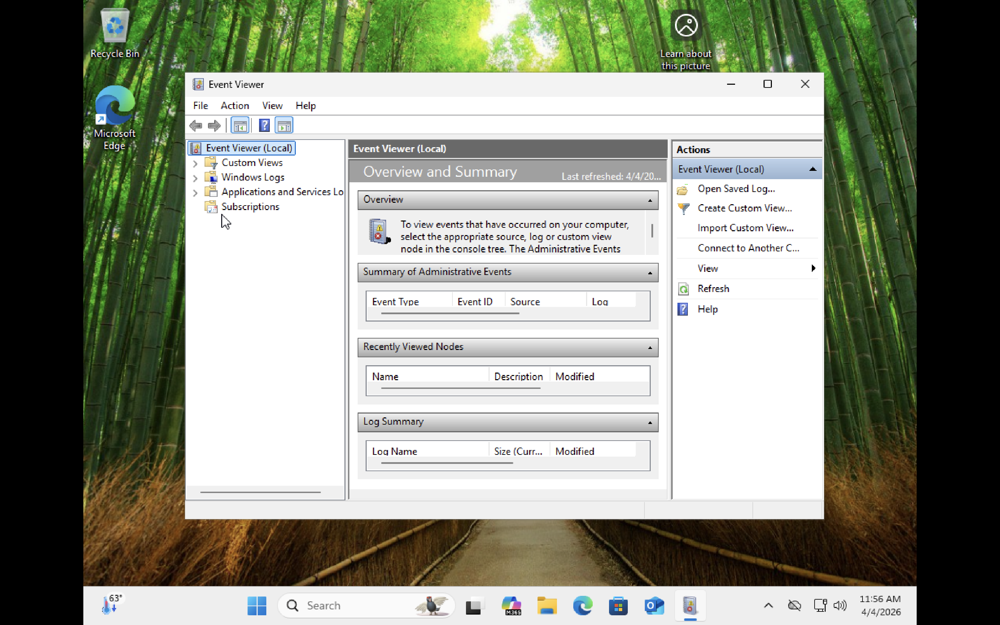
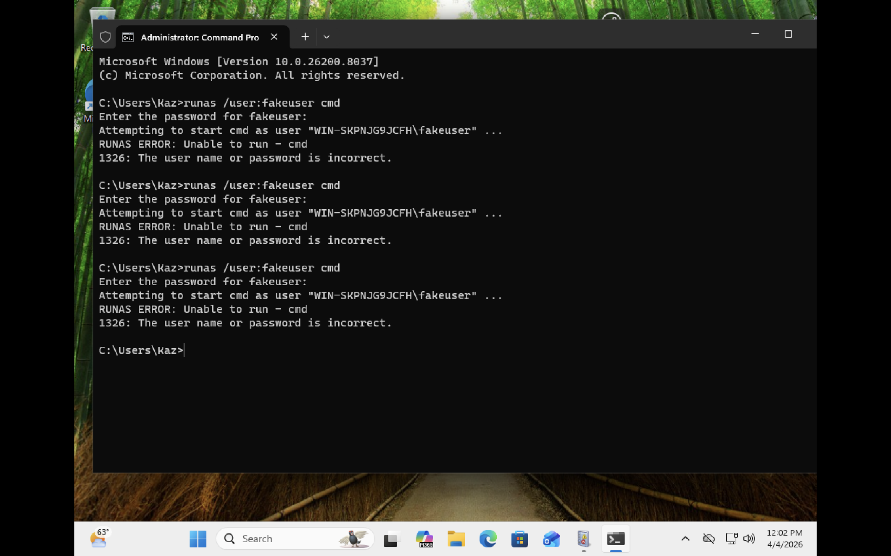
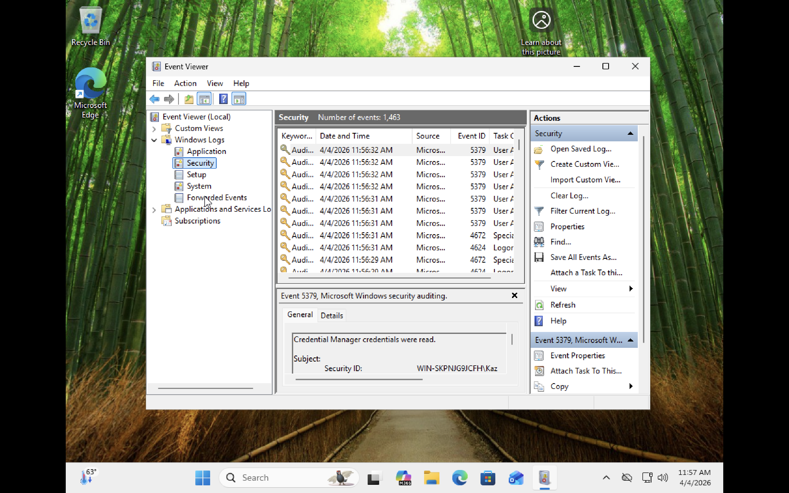
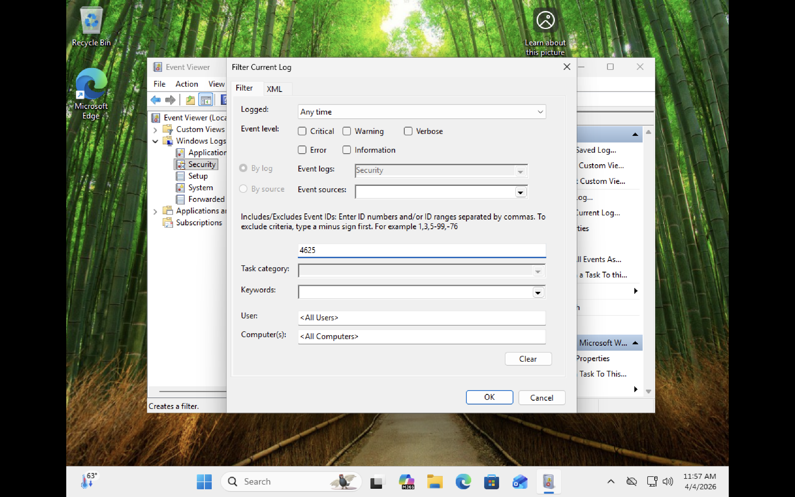
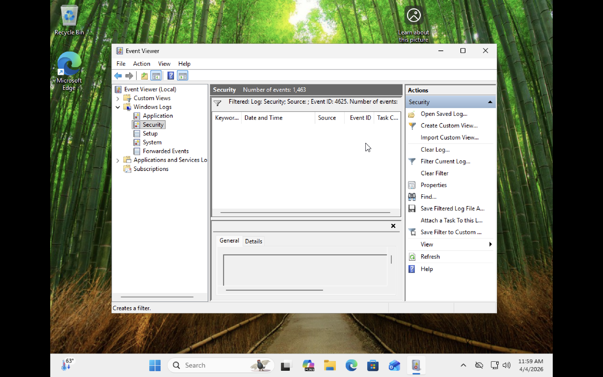
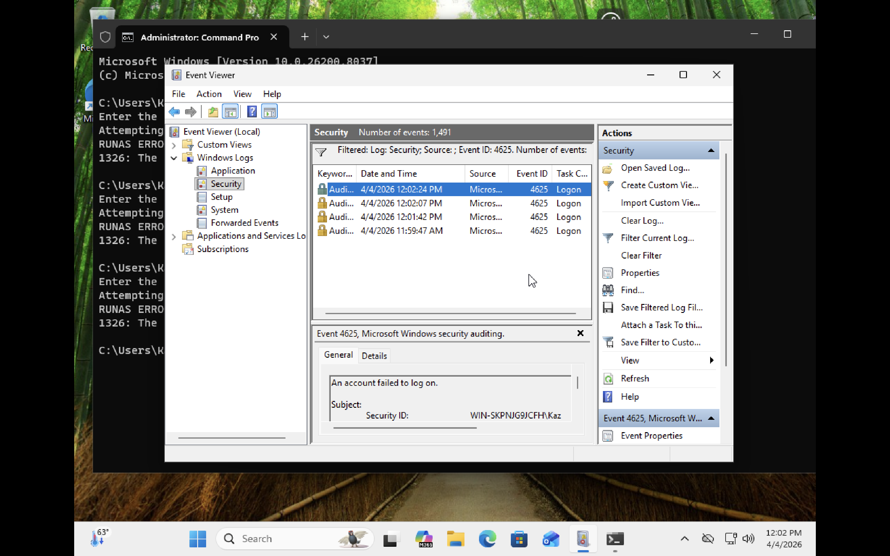

# Project 1 – Windows Event Log Investigation & Failed Authentication Analysis


---

## Overview

This project simulates a real-world security investigation using **Windows Event Viewer** to identify failed authentication attempts and suspicious login activity on a Windows endpoint. By generating controlled failed logon events and filtering the Security log for specific Event IDs, this project demonstrates the foundational log analysis skills used daily by SOC analysts, incident responders, and security engineers.

---

## Environment

| Tool | Purpose |
|------|---------|
| Windows Event Viewer | Primary log analysis tool |
| Windows Security Log | Source of authentication and logon events |
| Command Prompt (Admin) | Used to simulate failed logon attempts via runas |
| Windows VM | Isolated lab endpoint |
| GitHub | Documentation and version control |

---

## Key Event IDs Reference

| Event ID | Description | Why It Matters |
|----------|-------------|----------------|
| 4625 | An account failed to log on | Indicates failed authentication — key brute force indicator |
| 4624 | An account was successfully logged on | Baseline for normal logon activity |
| 4672 | Special privileges assigned to new logon | Indicates privileged access granted at logon |
| 5379 | Credential Manager credentials were read | Indicates credential access activity |

---

## Investigation Walkthrough

---

### 🟡 Step 1 — Opened Windows Event Viewer

Launched Event Viewer on the Windows VM and confirmed the overview dashboard was accessible. The tool displays Windows Logs including Application, Security, Setup, System, and Forwarded Events.

The **Security log** is the primary source for authentication, logon, privilege use, and account management events — making it the most critical log for threat detection.


*Windows Event Viewer launched — Overview and Summary dashboard showing available log categories*

---

### 🔴 Step 2 — Simulated Failed Logon Attempts

Used the `runas` command in an Administrator Command Prompt to simulate multiple failed authentication attempts against a nonexistent local account (`fakeuser`). This generated real Event ID 4625 entries in the Security log.

**Command Used:**
```cmd
runas /user:fakeuser cmd
```

**Result:** RUNAS ERROR 1326 — The user name or password is incorrect. This was repeated 3 times to generate multiple failed logon events for investigation.


*Command Prompt showing 3 consecutive RUNAS ERROR 1326 failures simulating a brute force pattern*

---

### 🔵 Step 3 — Navigated to the Security Log

Opened the Security log under Windows Logs in Event Viewer. The log showed 1,463 total events captured on the endpoint. Initial review revealed a mix of Event ID 5379 (Credential Manager reads), Event ID 4672 (special privileges), and Event ID 4624 (successful logons).


*Security log displaying 1,463 events including credential access and logon activity*

---

### 🟠 Step 4 — Applied Filter for Event ID 4625

Used the **Filter Current Log** feature to isolate only Event ID 4625 (failed logon) events from the Security log. This is a core SOC analyst technique — filtering noise from a high-volume log to focus on specific threat indicators.

**Filter Applied:**
- Log: Security
- Event ID: 4625


*Filter Current Log panel with Event ID 4625 entered — isolating failed authentication events only*

---

### 🔴 Step 5 — Confirmed Filter Applied (No Prior Events)

After applying the filter, the Security log displayed the active filter banner confirming: **Filtered: Log: Security; Event ID: 4625.** At this point no events had populated yet as the failed logon simulation had not yet been run, establishing a clean baseline before generating the attack activity.


*Filter active on Security log for Event ID 4625 — clean baseline before simulated attack*

---

### 🚨 Step 6 — Identified Failed Logon Events (4625)

After running the `runas` simulation, the filtered Security log populated with **4 Event ID 4625 entries** — all timestamped within minutes of each other. This clustering of failed logon attempts within a short time window is a textbook indicator of a brute force or credential stuffing attack pattern.

**Event Details Captured:**

| Field | Value |
|-------|-------|
| Event ID | 4625 |
| Description | An account failed to log on |
| Security ID | WIN-SKPNJG9JCFH\Kaz |
| Timestamps | 11:59:47 AM, 12:01:42 PM, 12:02:07 PM, 12:02:24 PM |
| Task Category | Logon |
| Status | Audit Failure |


*Security log filtered for Event ID 4625 — 4 failed logon events detected in rapid succession, consistent with brute force activity*

---

## Threat Analysis Summary

| Indicator | Finding |
|-----------|---------|
| Event ID | 4625 — An account failed to log on |
| Number of Failures | 4 events within 3 minutes |
| Target Account | fakeuser (nonexistent local account) |
| Source Machine | WIN-SKPNJG9JCFH |
| Attack Pattern | Repeated rapid failures = brute force indicator |
| Credential Access | Event ID 5379 also observed (Credential Manager reads) |
| Response Action | Investigate source, review account lockout policy, escalate if on production system |

---

## Skills Demonstrated

| Skill | How It Was Applied |
|-------|--------------------|
| Log Analysis | Navigated and interpreted Windows Security event logs |
| Threat Detection | Identified failed authentication patterns consistent with brute force |
| Event Filtering | Used Event Viewer filter to isolate specific Event IDs from 1,400+ events |
| Attack Simulation | Generated controlled failed logon events using runas command |
| IOC Identification | Identified key indicators: rapid failures, nonexistent account, clustering |
| SOC Investigation Workflow | Followed a structured baseline, simulate, detect, analyze process |
| Documentation | Captured timestamped evidence and produced audit-ready findings |

---

## Lessons Learned

**Volume is the enemy of visibility.** The Security log had over 1,400 events in a single session. Without filtering by Event ID, finding the 4 failed logon events would have been like finding a needle in a haystack. This is exactly why SOC analysts rely on SIEM tools that do this filtering automatically at scale — but understanding the raw logs first is what makes a SIEM operator effective, not just dependent on the tool.

**Patterns matter more than individual events.** One failed logon is normal. Four failed logons in three minutes against a nonexistent account is a threat signal. This project reinforced that log analysis is not about reading individual events — it is about recognizing behavioral patterns that deviate from baseline. That pattern recognition skill is what separates a reactive analyst from a proactive one.

**Simulating attacks makes you a better defender.** By generating the Event ID 4625 entries myself using `runas`, I understood exactly what the attacker's activity looks like from the defender's perspective. Knowing how an attack is generated helps you tune detection rules, set appropriate alert thresholds, and explain findings clearly to stakeholders during an incident.

---

## Real-World Application

Event ID 4625 monitoring is one of the most fundamental detection use cases in enterprise security. SOC analysts monitor for spikes in 4625 events to detect brute force attacks, password spraying, and credential stuffing in real time. This project directly mirrors the investigation workflow used in Security Operations Centers and forms the foundation for building SIEM detection rules in tools like Microsoft Sentinel, Splunk, and IBM QRadar.

---

## References

- [Microsoft Event ID 4625 Documentation](https://learn.microsoft.com/en-us/windows/security/threat-protection/auditing/event-4625)
- [Windows Security Log Encyclopedia](https://www.ultimatewindowssecurity.com/securitylog/encyclopedia/)
- [NIST SP 800-92 – Guide to Computer Security Log Management](https://csrc.nist.gov/publications/detail/sp/800-92/final)
